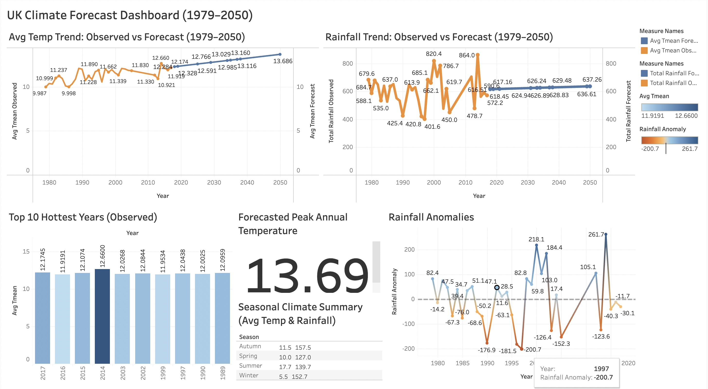

# 🌍 UK Climate Change Impact Analysis (1979–2050)

This project analyzes historical UK weather data and forecasts future climate trends using machine learning and time-series models.

---

## 🔎 Contents

- 📓 `Climate change.ipynb`: Full analysis + forecasting (ARIMA, Prophet)
- 📁 `Datasets/`: Cleaned and processed datasets from Heathrow and Met Office
- 📊 `Dashboard/`: Tableau dashboard for interactive visual exploration
- 📈 Forecasts: CSV files predicting temperature & rainfall to 2050

---

## 🛠️ Tools Used

- Python (Pandas, Matplotlib, statsmodels, Prophet)
- Tableau
- CSV handling + data cleaning + seasonal trend analysis

---

## 🌱 Outcome

- Detected warming trends in UK climate
- Forecasted rising temperatures and rainfall variations till 2050
- Built an interactive dashboard for stakeholders and policymakers

---

## 📊 Sample Visualization


> *Dashboard shows trend anomalies and forecasted climate change indicators*

---

## ⚙️ How to Run

1. **Clone this repository**  
   ```bash
   git clone https://github.com/HerambJadhav604/UK-Climate-Forecast-Project.git
   cd UK-Climate-Forecast-Project
Install the required libraries

bash
Copy
Edit
pip install pandas matplotlib statsmodels prophet
Run the notebook

bash
Copy
Edit
jupyter notebook "Climate change.ipynb"
📌 Requires Python 3.7+, Jupyter, and Prophet installed.

📄 License
This project is licensed under the MIT License.

🙋‍♂️ Author
Heramb Jadhav
GitHub: HerambJadhav604

